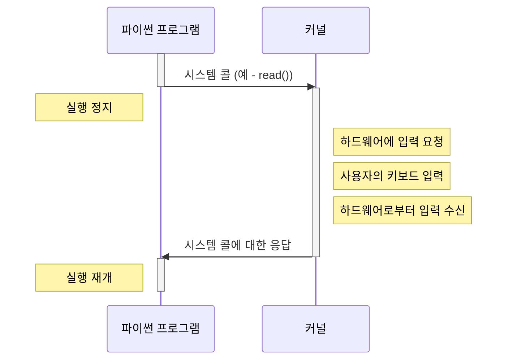
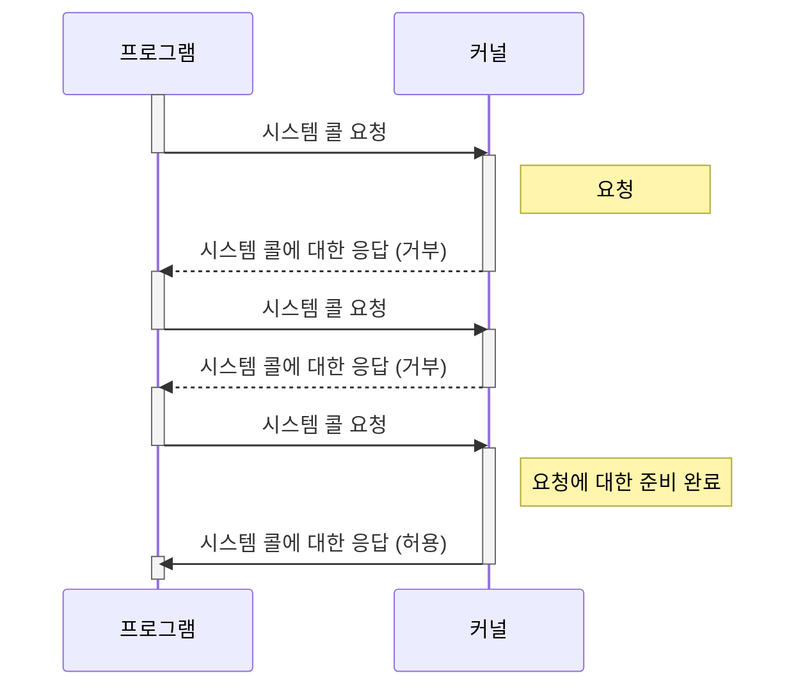

# Blocking / Non-blocking I/O
## Blocking I/O

블록킹 입출력은 입력 및 출력이 완료될 때까지 코드의 흐름이 멈춰있는 방식의 입출력을 의미한다.

아래 파이썬 코드를 예로 들면

```python
a = input("무엇이든 입력해보세요")
print(a)
```

위 코드의 실행 타임라인은 아래와 같다.



위에서 파이썬의 input 함수가 위 타임라인 도표의 Read()에 대응되며 Read() 함수가 실행이 종료될때까지 프로그램의 실행은 멈춰있게 된다. read 함수를 호출한 순간부터 프로그램의 제어권은 커널이 가지게 되는 것이다.

그래서 사용자가 입력을 완료하지 않는 이상 위 프로그램은 실행이 중단되게 되는 것이다. 시스템 콜과 같은 대상과 입출력을 수행하는 동안 프로그램이 중지되어 있다면 이런 방식은 블록킹 입출력이 되는 것이다.

일반적으로 OS 위에서 구동되는 애플리케이션은 커널 함수 (시스템 콜)을 호출시키며 동작된다. 문자 입출력, 네트워크 소켓 통신 모두 시스템 콜을 사용하며 이에 대한 Input 및 Output 모두 시스템 콜을 사용해야 한다.

## Non-blocking I/O

애플리케이션이 시스템 콜에 입출력 명령을 넘길 때 시스템 콜에 의해 프로그램이 중지되지 않는 것을 논블록킹 입출력이라고 한다.

위 예제를 비동기 입출력으로 바꾼다면 별 의미가 없으므로 별도로 예제는 들지 않는다. 실제로는 파일 읽기, 네트워킹 등에 적용할 수 있다.

아래는 polling 방식으로 이벤트 발생 여부를 조회하는 방식이다.



콜백 함수, 시그널, I/O 멀티플랙싱 등으로 입출력 명령에 대한 결과를 회신한다.