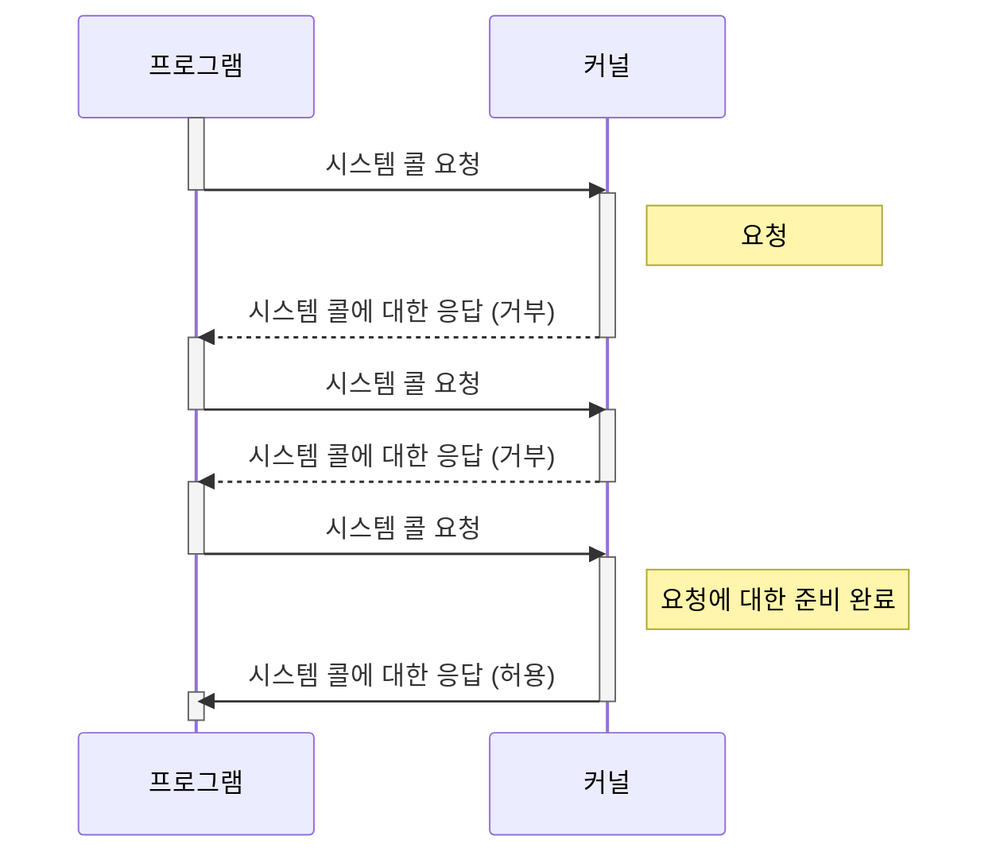

# polling과 I/O Multiplexing
# polling

## fd (File Descriptor)

파일 디스크립터는 파일 자원을 가리키는 번호이다. 유닉스 계열의 OS에서는 모든 자원이나 장치들을 파일처럼 관리하기 때문에 입출력 자원들도 파일처럼 관리한다. 그래서 파일 읽기나 쓰기, 소켓 통신, 하드웨어 접근 등을 자원을 가리키는 번호인 fd를 통해서 수행한다.

(일반적으로) 파일 디스크립터는 프로세스가 생성될 때 프로세스 당 하나의 파일 디스크립터 테이블을 소유하며 기본적으로 0, 1, 2(표준 입력, 출력, 에러)가 올라가 있다.

만약에 이 프로세스에서 파일을 열거나 소켓을 열 때에 그 대상에 맞는 파일 디스크립터가 이 테이블에 추가된다.

파일 디스크립터는 음수를 제외한 정수를 가질 수 있다.

## fd의 블록킹

파일 디스크립터에 read와 write와 같은 시스템 콜을 이용해 그 자원에 데이터를 읽고 쓸 수 있다. 그런데 보통 파일 디스크립터가 가리키는 대상이 read나 write를 호출해서 읽거나 쓰는 동작을 할 만한 상태가 아니라면 그 시스템 콜에서 블락되어서 가만히 있는다. 읽거나 쓰는 동작이 될 때까지 기다리는 것이다.

이는 비동기 프로그래밍을 할 때 취약하다. 프로그램이 완전히 하나의 기능을 하면 괜찮겠지만 보통 그렇지 않기 때문에 블록킹이 되면 프로그램이 아예 멈춘것처럼 보이기 때문이다.

그래서 블록킹이 되는 코드를 프로세스나 스레드로 분리하여 다른 프로세스나 스레드에서 처리하는 방법을 생각해 볼 수 있다.

그런데 보통 프로세스나 스레드를 새로 생성하는 것은 컴퓨터의 자원도 많이 먹으며 속도가 저하될 수 있다. 또 그렇게 코딩하는 것이 관리해야 하는 자원들이 많아져 코딩하기 어려울 것이다.

## polling

폴링이란 특정 장치나 프로그램에 대해 상태를 주기적으로 검사하여 특정 조건이 만족할 때에 정해진 처리를 하는 것이다.

파일 읽기/쓰기나 소켓 통신 등을 처리하는 싱글 스레드 프로그램을 만들 때 요청에 대한 응답이 즉각적으로 리턴되지 않으므로 논블록킹을 주로 사용하게 된다. 이 때 파일 읽기/쓰기나 소켓 통신의 상태를 주기적으로 검사하여 대상이 준비가 될 때 작업을 수행한다.

위 플로우차트를 보면 커널 단에서 요청에 대해 준비가 완료될 때까지 주기적으로 커널에 요청을 보내게 되는데 이런 방식을 polling이라고 한다.

# I/O Multiplexing

멀티 프로세스나 멀티 스레드를 사용한다면 하나의 프로세스나 스레드에서 하나의 파일 읽기/쓰기나 소켓 통신 등 입출력 동작을 맡아 처리하게 할 수 있다. 하지만 싱글 스레드를 사용한다면 하나의 스레드에서 여러개의 입출력을 다뤄야 한다.

이런 경우는 논블록킹 방식으로 입출력을 다뤄야 한다. 특정 입출력에 프로세스가 블록킹되어 있다면 다른 입출력을 다루지 못하기 때문이다.

multiplexing은 다중화라는 의미이며 하나의 선로에 여러 신호를 다루는 개념이나 방식을 의미한다. 하지만 여기서의 I/O Multiplexing은 여러개의 입출력을 하나의 fd를 통해서 한다는 의미는 아니며 하나의 프로세스(스레드)가 여러개의 fd에 대해서 작업을 할 준비가 되었는지 체크하는 것을 의미한다.

# I/O Multiplexing 방법들

## select

select 시스템 콜은 리눅스/유닉스가 제공하는 시스템 콜이다. select 시스템 콜은 파일 디스크립터들을 받아 특정 fd가 읽기/쓰기 준비가 되었는지 알려주는 역할을 한다.

## poll

select의 단점이 개선된 시스템 콜이다.

## epoll / kqueue

각각 리눅스와 BSD에서 제공하는, fd와 같은 식별자에 대해 이벤트를 확인할 수 있는 시스템 콜이다. select나 poll과 비교하여 더 다양한 기능들과 설정들을 제공한다.