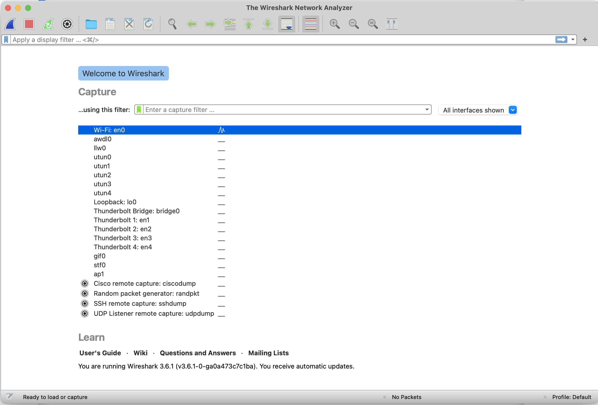
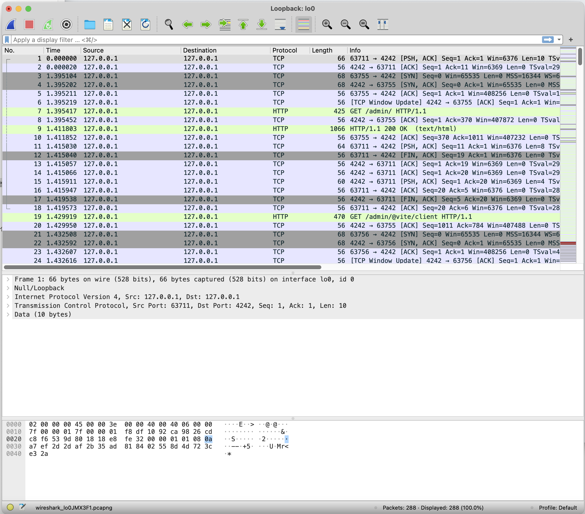
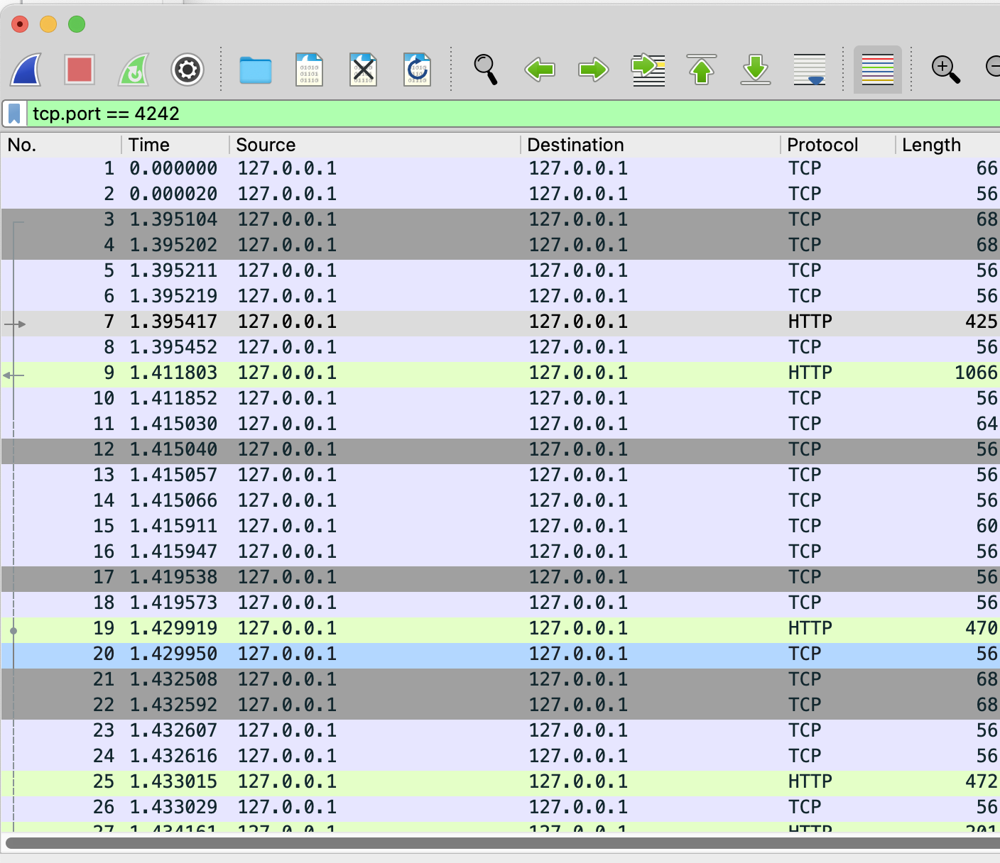

# 와이어샤크 기본 가이드

## 와이어샤크 설치

[Wireshark · Go Deep.](https://www.wireshark.org/#download)

와이어샤크 설치를 할 때 같이 설치되는 pcap 관련 라이브러리도 반드시 같이 설치하여야 합니다.

- pcap 관련 라이브러리는 패킷 스니핑을 하기 위한 라이브러리이며 와이어샤크는 스니핑한 패킷을 보여주는 프로그램입니다.

## 사용

### 시작화면



현재 PC에서 와이어샤크가 접근 가능한 네트워크 어댑터 목록을 보여줍니다.

목록에 이것저것 많아서 고르시는 데 혼란스러우실 수도 있지만

보통 맥이나 리눅스에선 enX, loX (en1, en2, ... 혹은 lo0, lo1, ... → 각각 이더넷과 루프백을 의미합니다.)라는 이름의 어댑터를 선택하며 윈도우는 로컬 연결 ~ 로 시작하는 어댑터를 선택합니다.

루프백 어댑터는 자기 자신을 가리키는 IP (예를 들면 127.0.0.1이 있습니다.)에 대한 연결을 담당하는 어댑터입니다. 따라서 자기 자신에게 접속할 때 패킷 분석을 하고 싶다면 루프백 어댑터를 고르는 것이 일반적입니다.

로컬에서 nginx 등의 서버 프로그램을 동작시키고 로컬에서 브라우저나 postman , curl 등으로 HTTP 요청을 보낼 때에는 루프백 네트워크 어댑터 (lo0)을 고릅니다.

윈도우즈에선 기본적으로 루프백 어댑터를 제공하지 않으므로 로컬 연결로 시작하는 어댑터를 고르면 됩니다.

참고로 오른쪽에 시간당 패킷 전송 현황이 그래프로 나오므로 선택에 참조하시길 바랍니다.

### 패킷 캡쳐 화면



화면은 메뉴를 제외하면 세가지로 구성되어 있으며 다음과 같습니다.

- 캡쳐된 패킷 목록
    - 시간, 패킷의 출발지와 목적지, 프로토콜, 길이, 정보를 보여줍니다.
    - 이 화면에서 마우스로 패킷을 고르면 상세 정보가 밑의 두개의 화면에 나옵니다.
- 선택된 패킷의 상세 정보
    - 와이어샤크가 분석한 패킷의 정보를 상세하게 보여줍니다.
- 패킷의 raw 바이트
    - 실제로 송수신한 패킷이 위치하며 위 상세 정보 화면에서 패킷의 요소를 선택하면 실제로 어느 요소를 가리키는지도 알 수 있습니다.

### 패킷 필터링

와이어샤크의 패킷 필터링 옵션은 다양합니다. 필요하시면 추가 옵션을 찾으셔서 적용해 보시면 좋을 것 같습니다. 하지만 보통 port 번호로 필터링 하는 것만으로도 충분합니다.

캡쳐된 패킷 목록 바로 위에 필터를 작성할 수 있으며 tcp 패킷의 4242번 포트에 대해 수신 및 송신이 일어난 패킷을 거르는 필터는 다음과 같습니다.

```
tcp.port == 4242
```

적용한 예시는 다음과 같습니다.



필터를 적용하면 필터의 조건에만 부합하는 패킷만 목록에 뜨게 됩니다.

참고로 위에서 HTTP라고 인식되는 패킷은 와이어샤크가 해당 패킷을 HTTP라고 인식했을 경우에만 HTTP라고 뜨게 됩니다.

TCP 3 핸드쉐이킹과 요청에 대한 응답, 연결 해제를 위한 4 핸드쉐이킹 등이 섞여 있습니다.

## 상황별 예시

### 1. 동작되지 않는 로컬 서버에 브라우저로 접근을 시도할 때


브라우저(src port : 63820)가 동작되지 않는 서버(3000)로 http request를 보내기 위해 3-way handshaking을 시도하였지만 서버가 RST 패킷을 보내 거절하였습니다.

그 후 브라우저가 다시 (src port : 63821) 보내보았지만 동일하게 거절당했습니다.

서버와 브라우저 모두 로컬에서 동작하므로 루프백 어댑터를 선택해야 합니다.

### 2. 동작되는 원격 서버(nginx)에 브라우저로 접근을 시도할 때


맨 위에 3개 패킷을 보면 브라우저가 서버에게 3개의 요청을 각각 다른 포트에서 같은 타겟으로 날린 것을 확인하실 수 있습니다. (왜 그런진 저도 모르겠습니다.)

이후 3-way handshaking을 완료한 후 3개의 연결 중 하나의 연결에만 GET 요청을 보냅니다.

이후 서버는 클라이언트에게 HTTP 리스폰스를 보내는데, 주의해야 할 점이 TCP 세그먼트가 두번으로 나누어져서 HTTP 메시지를 전송한 것입니다.

HTTP 패킷이 나누어져서 보내지는 경우는 하나의 tcp 세그먼트가 전달할 수 있는 최대의 데이터 크기가 있는데 HTTP 데이터는 보통 그 데이터 크기보다 큰 경우가 많기 때문에 여러개의 TCP 세그먼트가 조합되어 HTTP 메시지를 완성하는 것입니다.

이후 60초동안 서버와 클라이언트는 연결을 유지하고 있습니다. 왜냐 하면 HTTP 1.1에선 영속적 연결을 지원해야 하기 때문에 클라이언트에 대한 응답이 끝나고 서버나 클라이언트가 임의로 연결을 끊으면 안됩니다. (이에 대한 상세한 설정은 HTTP 헤더의 Connection에서 설정할 수 있습니다. 상세한 정보는 `http 영속적 연결` 과 같은 키워드로 구글링 해보시면 도움이 되실 것입니다.) 그리고 nginx엔 영속적 연결을 유지할 때 최대 유지하는 시간을 설정할 수 있는데 그 시간이 60초이기 때문에 60초동안 아무런 패킷 송수신이 없다면 연결을 끊습니다.